# 🗄️ Data Transformer — Corporate Data Analysis System

> A structured SQL project simulating a real-world corporate database with **Customers**, **Orders**, and **Employees** — covering joins, subqueries, date functions, string manipulation, window functions, and business logic.


---

## 📌 Project Overview

This project simulates a **Corporate Data Analysis System** with three core modules:

| Module | Description |
|--------|-------------|
| 👥 Customer Information Management | Track and analyze customer profiles |
| 🛒 Sales Transaction Processing | Process and rank order data |
| 👔 Employee Performance Data | Evaluate employee salaries and departments |

---

## 🗂️ Database Schema

```
corp_data_hub
├── Customers   (CustomerID, Firstname, Lastname, Email, RegistrationDate)
├── Orders      (OrderID, CustomerID, Order_date, Total_amount)
└── Employees   (EmployeeID, FirstName, LastName, Department, HireDate, Salary)
```


## 📊 Sample Data Preview

### 👥 Customers Table
| CustomerID | Firstname | Lastname | Email | RegistrationDate |
|-----------|-----------|----------|-------|-----------------|
| 1 | john | doe | john.doe@gmail.com | 2022-03-15 |
| 2 | jane | smith | jane.smith@gmail.com | 2021-11-02 |
| ... | ... | ... | ... | ... |
> 10 rows total

### 🛒 Orders Table
| OrderID | CustomerID | Order_date | Total_amount |
|---------|-----------|------------|--------------|
| 100 | 1 | 2023-07-01 | 150.90 |
| 104 | 5 | 2023-05-10 | 1200.50 |
| ... | ... | ... | ... |
> 10 rows total | Amounts range: $45 → $1,200.50

### 👔 Employees Table
| EmployeeID | FirstName | Department | Salary |
|-----------|-----------|------------|--------|
| 5 | Brian | Finance | 85000.00 |
| 8 | Rachel | Finance | 91000.00 |
| ... | ... | ... | ... |
> 10 rows | Departments: Sales, HR, IT, Finance

---

## 🚀 Queries & Results

### 🔗 JOIN Operations

---

#### 1️⃣ INNER JOIN — Matched Customers & Orders
> Returns only customers who have placed orders.

```sql
SELECT c.*, o.* 
FROM Customers c 
INNER JOIN Orders o ON c.CustomerID = o.CustomerID;
```
📸 **Result:**

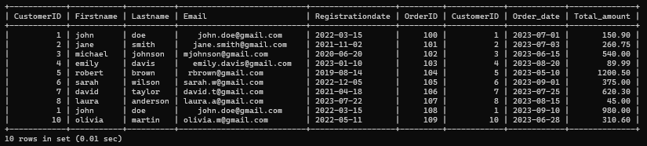

---

#### 2️⃣ LEFT JOIN — All Customers with Orders (if any)
> Returns all customers — NULL shown for those without orders.

```sql
SELECT c.*, o.* 
FROM Customers c 
LEFT JOIN Orders o ON c.CustomerID = o.CustomerID;
```
📸 **Result:**

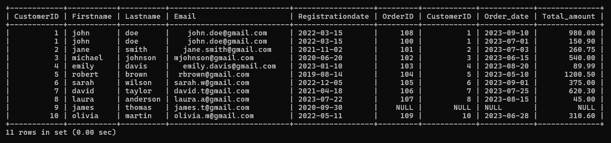

---

#### 3️⃣ RIGHT JOIN — All Orders with Customer Details
> Returns all orders regardless of matching customer.

```sql
SELECT o.*, c.* 
FROM Customers c 
RIGHT JOIN Orders o ON c.CustomerID = o.CustomerID;
```
📸 **Result:**

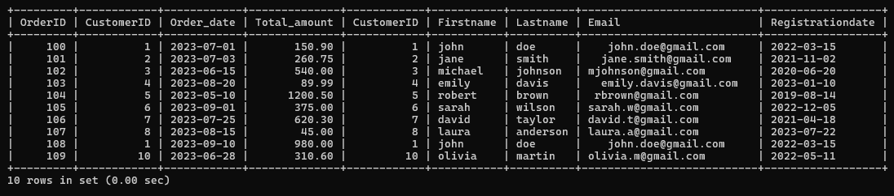

---

#### 4️⃣ FULL OUTER JOIN (via UNION)
> Returns all records from both tables — matched and unmatched.

```sql
SELECT c.*, o.* FROM Customers c LEFT JOIN Orders o ON c.CustomerID = o.CustomerID
UNION
SELECT c.*, o.* FROM Customers c RIGHT JOIN Orders o ON c.CustomerID = o.CustomerID;
```
📸 **Result:**

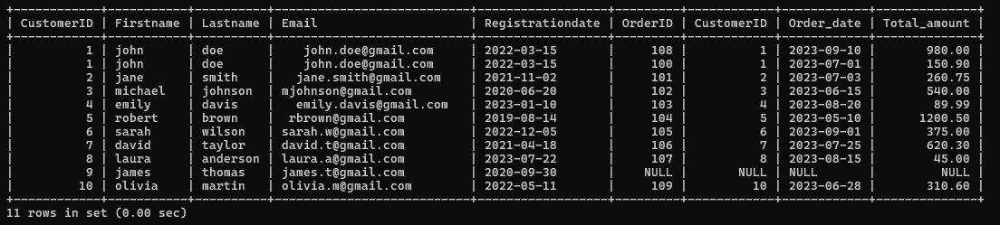

---

### 🔍 Subqueries

---

#### 5️⃣ Customers with Above-Average Order Amount

```sql
SELECT c.CustomerID, c.Firstname, c.Lastname, o.OrderID, o.Order_date, o.Total_amount 
FROM Customers c LEFT JOIN Orders o ON c.CustomerID = o.CustomerID 
WHERE o.Total_amount > (SELECT AVG(Total_amount) FROM Orders);
```
📸 **Result:**

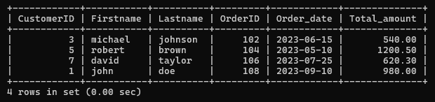

---

#### 6️⃣ Employees Earning Above Average Salary

```sql
SELECT EmployeeID, FirstName, LastName, Department, Salary 
FROM Employees 
WHERE Salary > (SELECT AVG(Salary) FROM Employees);
```
📸 **Result:**

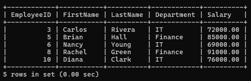

---

### 📅 Date Functions

---

#### 7️⃣ Extract Year & Month from Order Date

```sql
SELECT *, YEAR(Order_date) AS YEAR, MONTH(Order_date) AS MONTH FROM Orders;
```
📸 **Result:**

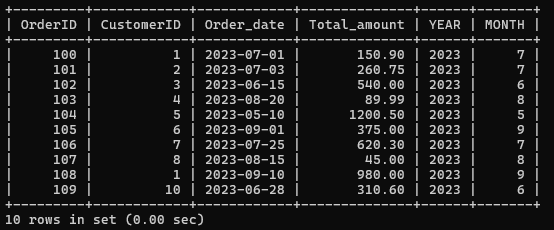

---

#### 8️⃣ Days Difference (Order Date → Today)

```sql
SELECT OrderID, Order_date, CURDATE(), 
TIMESTAMPDIFF(day, Order_date, CURDATE()) AS diff_in_days 
FROM Orders;
```
📸 **Result:**

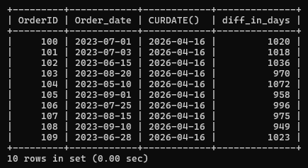

---

#### 9️⃣ Format Order Date (DD-Month-YYYY)

```sql
SELECT *, DATE_FORMAT(Order_date, "%d-%M-%Y") AS DIFF_DATE_FORMAT FROM Orders;
```
📸 **Result:**

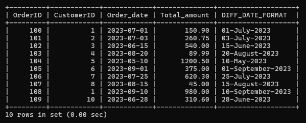

---

### 🔤 String Functions

---

#### 🔟 Concatenate Full Name

```sql
SELECT EmployeeID, FirstName, LastName, 
CONCAT(FirstName,' ',LastName) AS full_name 
FROM Employees;
```
📸 **Result:**

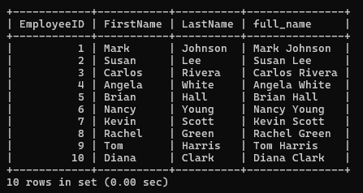

---

#### 1️⃣1️⃣ Replace String Value

```sql
SELECT *, REPLACE(Firstname, 'john','jonathan') AS replace_name FROM Customers;
```
📸 **Result:**

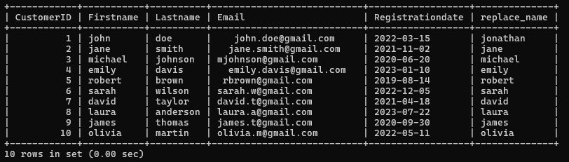

---

#### 1️⃣2️⃣ UPPER / LOWER Case

```sql
SELECT EmployeeID, UPPER(Firstname) AS uppercase, LOWER(Lastname) AS lowercase 
FROM Employees;
```
📸 **Result:**

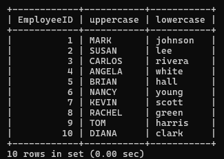

---

#### 1️⃣3️⃣ TRIM Whitespace from Email

```sql
SELECT CustomerID, Firstname, Lastname, Email, TRIM(Email) AS trim_email 
FROM Customers;
```
📸 **Result:**

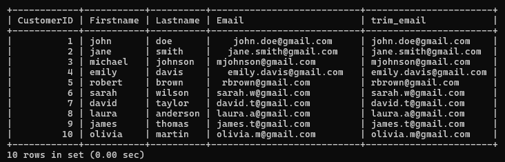

---

### 🪟 Window Functions

---

#### 1️⃣4️⃣ Running Total of Order Amounts

```sql
SELECT *, SUM(Total_amount) OVER(ORDER BY Total_amount) AS running_total_amt 
FROM Orders;
```
📸 **Result:**

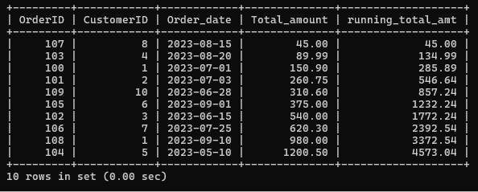

---

#### 1️⃣5️⃣ Rank Orders by Total Amount

```sql
SELECT *, RANK() OVER(ORDER BY Total_amount DESC) AS ranking FROM Orders;
```
📸 **Result:**

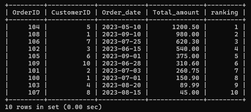

---

### 🎯 CASE Statements (Business Logic)

---

#### 1️⃣6️⃣ Discount Classification by Order Amount

```sql
SELECT *, CASE 
    WHEN Total_amount > 1000 THEN '10% off'
    WHEN Total_amount > 500  THEN '5% off'
    WHEN Total_amount > 300  THEN '3% off'
    ELSE 'No discount' 
END AS discount 
FROM Orders;
```
📸 **Result:**

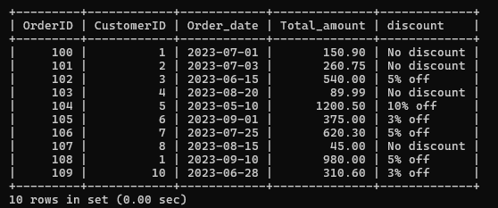

---

#### 1️⃣7️⃣ Employee Salary Category

```sql
SELECT *, CASE 
    WHEN Salary > 80000 THEN 'High'
    WHEN Salary > 60000 THEN 'Medium'
    ELSE 'Low' 
END AS salary_category 
FROM Employees;
```
📸 **Result:**

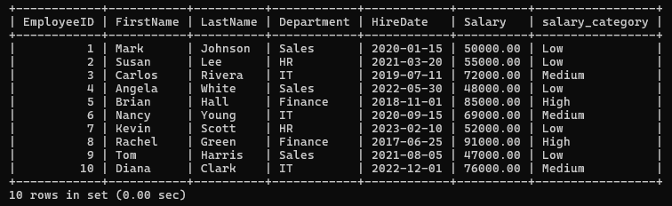

---

## 🧠 Concepts Covered

| Category | Concepts |
|----------|----------|
| 🔗 Joins | INNER, LEFT, RIGHT, FULL OUTER (UNION) |
| 🔍 Subqueries | Correlated & non-correlated subqueries |
| 📅 Date Functions | YEAR(), MONTH(), CURDATE(), TIMESTAMPDIFF(), DATE_FORMAT() |
| 🔤 String Functions | CONCAT(), REPLACE(), UPPER(), LOWER(), TRIM() |
| 🪟 Window Functions | RANK(), SUM() OVER() |
| 🎯 Conditional Logic | CASE WHEN statements |

---

## 🗃️ How to Run

```bash
# 1. Open MySQL Workbench or any MySQL client
# 2. Run the SQL file
source data_transformer.sql

# Or copy-paste directly into your MySQL terminal
```

> ✅ Tested on **MySQL 8.0**

---

## 👤 Author

**Harshal Vora**
📧 Connect on [GitHub](https://github.com/HarshalVora86)

---

## 📁 Project Structure

```
Data_Transformer/
├── data_transformer.sql     # Main SQL file with all queries
├── README.md                # Project documentation
└── screenshots/
    ├── p1_all_tables.png
    ├── p2_inner_join.png
    ├── p3_left_join.png
    ├── p4_right_join.png
    ├── p5_full_outer_join.png
    ├── p6_subquery_orders.png
    ├── p7_subquery_employees.png
    ├── p8_year_month.png
    ├── p9_days_diff.png
    ├── p10_date_format.png
    ├── p11_concat.png
    ├── p12_replace.png
    ├── p13_upper_lower.png
    ├── p14_trim.png
    ├── p15_running_total.png
    ├── p16_rank.png
    ├── p17_discount.png
    └── p18_salary_category.png
```
